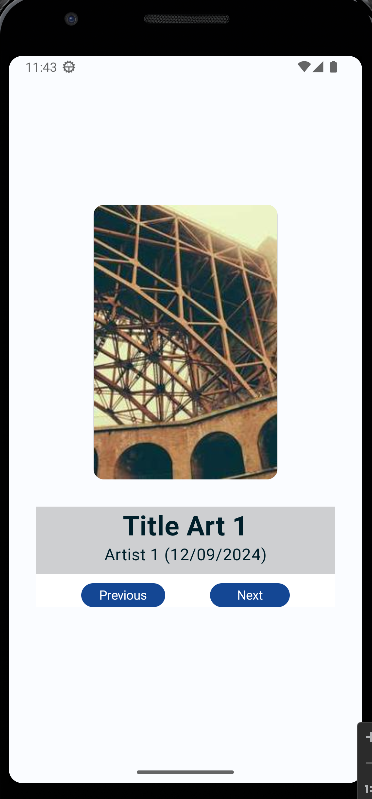
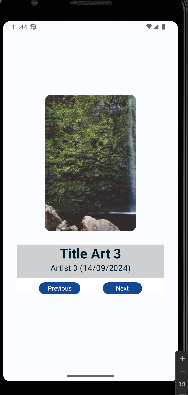
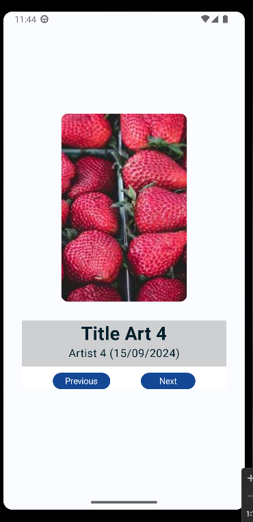
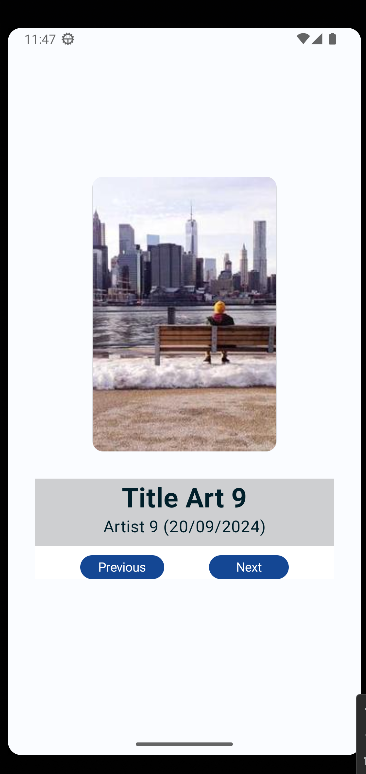

# Simple Art Space
## This is an activity from Google Developers Codelabs

### The technical features of this app are:
- Jetpack Compose
- Coil

### In this app the user can:
- Navigate through different images as a loop each time one of the buttons is clicked.
- Watch the information of the picture (Raw Data).

### Images

