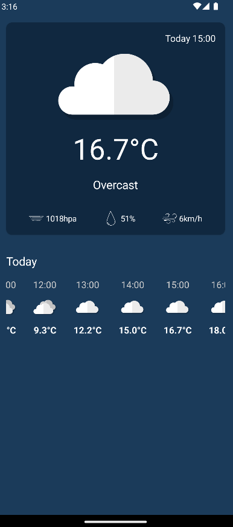

# Simple Weather App
## I learned to build this app with Philipp Lackner's YouTube videos

### The technical features of this app are:
- Clean Architecture
- JetPack Compose
- Device's Location Services
- Dependency Injection With Dagger Hilt
- Result Pattern
- Retrofit
- Open Meteo API

### In this app the user can:
- Watch the current weather and its variations through the day.

### Images

